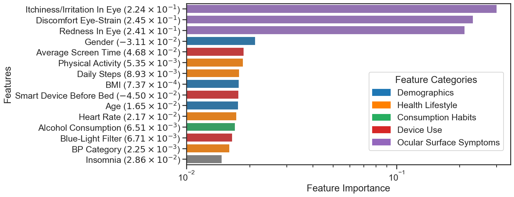

# Machine Learning Insights into Dry Eyes and Sleepless Nights

**Team**: [Debanjan Sarkar](https://github.com/debanjan-cosmo), [Anwesha Basu](https://github.com/AnweshaB12)  
**GitHub Repository**: [Erdos_Data_Science_Project_2025](https://github.com/debanjan-cosmo/Erdos_Data_Science_Project_2025)  
**Dataset**: *Dry Eye Disease Dataset* (sourced from [Kaggle](https://www.kaggle.com/datasets/dakshnagra/dry-eye-disease/data))

---

## Background and Project Overview

In this project, we explore the overlap between **Dry Eye Disease (DED)** and **insomnia**, two prevalent conditions with significant impact on quality of life. Using a publicly available dataset containing 20,000 records and 25 features, we aim to identify shared risk factors and build predictive models for both conditions.

The dataset includes a wide range of features—from demographics and health habits to screen time and ocular symptoms—making it suitable for uncovering behavioral patterns linked to DED and sleep quality. Insomnia was defined using a rule-based approach incorporating self-reported sleep issues.

---

## Objectives

- Understand how DED and insomnia are related  
- Identify which features are most influential in predicting each condition  
- Support preventive care strategies using interpretable ML models  

---

## Data Preprocessing

- Verified no missing values  
- Encoded categorical features  
- Engineered blood pressure categories from systolic/diastolic values  
- Derived a BMI-like feature from height and weight  
- Removed redundant/derived features to reduce noise  
- Created a binary insomnia label using five rule-based sleep conditions  
- Ensured data consistency across modeling tasks  

---

## Modelling Approach

We began with exploratory data analysis (EDA) to uncover distributions, patterns, and relationships among features and target labels (DED, insomnia, and both). The data was split into **80% training** (**20%** of which was used for **cross-validation**) and **20% testing**, with part of the training set reserved for cross-validation.

After benchmarking with baseline models (mean and random classifiers), we trained and compared multiple algorithms including:

- Gradient Boosting  
- Random Forest  
- Support Vector Classifier (SVC)  
- XGBoost

<div align="center">
  
  <p><em>Figure 1: Benchmark setting DED as target.</em></p>
</div>

<div align="center">
  
  <p><em>Figure 2: Benchmark setting 'Insomnia' as target.</em></p>
</div>

<div align="center">
  
  <p><em>Figure 3: Benchmark setting 'DED + Insomnia' as target.</em></p>
</div>

Based on performance, we shortlisted **Gradient Boosting**, **Random Forest**, and **XGBoost**. After hyperparameter tuning, **XGBoost** was chosen as the final model due to its high accuracy and faster training time. It was then used for feature importance analysis across different target labels.

---

## KPIs

- Model Accuracy  
- F1-Score  
- Training Time  
- Interpretability of Feature Importance  

---

## Results

### Dry Eye Disease (DED) Prediction:

<div align="center">
  
  <p><em>Figure 4: Feature importance for predicting DED, with features grouped by category.</em></p>
</div>


- Top predictors: ocular symptoms like redness and irritation  
- Gender (female) was strongly associated with DED  
- Insomnia was also a strong predictor, especially in younger, less active individuals  

### Insomnia Prediction:

<div align="center">
  
  <p><em>Figure 5: Feature importance for predicting Insomnia, with features grouped by category.</em></p>
</div>


- DED emerged as the most influential predictor  
- Other important features: caffeine intake, BMI, and screen time  

### Combined Condition (DED + Insomnia):

<div align="center">
  
  <p><em>Figure 5: Feature importance for predicting DED + Insomnia, with features grouped by category.</em></p>
</div>

- Key features: ocular symptoms, gender, device usage, and lifestyle factors  
- Gender-specific patterns, particularly in women, were observed  

---

## Summary and Future Directions

Our findings underscore a **strong bidirectional relationship** between eye health and sleep health. These insights highlight the need for **integrated clinical assessments** that consider both conditions together.

### Future Work:
- Expand the dataset with more detailed behavioral and environmental features  
- Validate insights against real-world clinical or longitudinal datasets  

---

## Stakeholders

- Healthcare providers  
- Medical researchers  
- Policy makers  
- Individuals impacted by DED or sleep disorders  

---

## Dependencies

The project uses the following Python libraries:


- [XGBoost](https://xgboost.readthedocs.io/en/stable/)  
- [Scikit-Learn](https://scikit-learn.org/stable/)  
- [Pandas](https://pandas.pydata.org/)  
- [NumPy](https://numpy.org/)  
- [Matplotlib](https://matplotlib.org/)  
- [Seaborn](https://seaborn.pydata.org/)  
- [KaggleHub](https://github.com/Kaggle/kagglehub)  
- [SHAP (SHapley Additive exPlanations)](https://shap.readthedocs.io/en/latest/) 

---

### Installation

Install all dependencies using:

```bash
pip install -r requirements.txt
